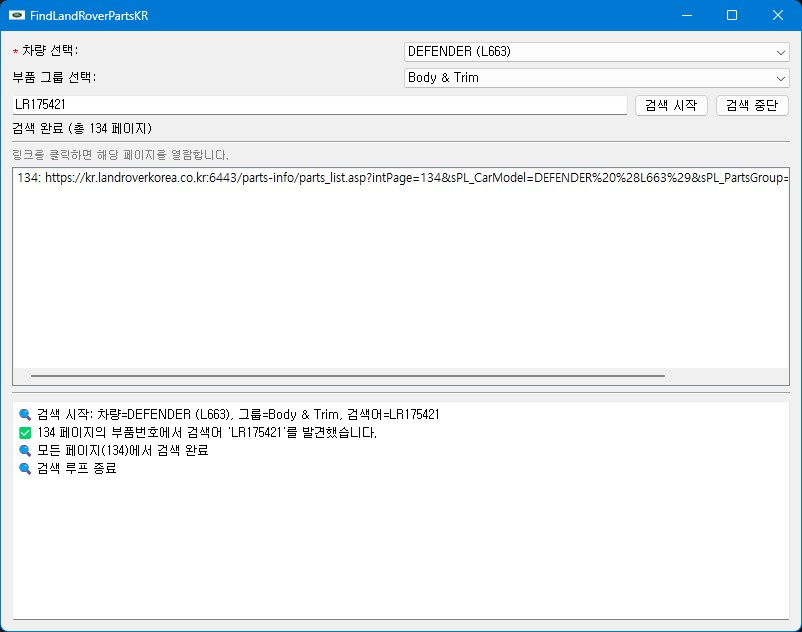
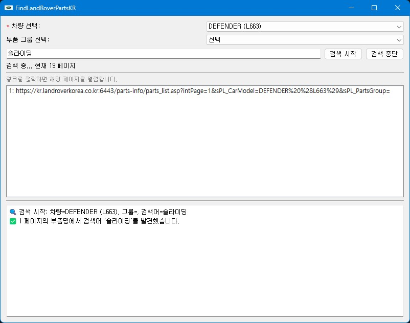

# FindLandRoverPartsKR

A tool to search Land Rover Korea parts price by part number or name.  
(부품번호나 부품명으로 한국 랜드로버 부품 가격을 검색하는 툴)

---
# <font color="red"><b>주의사항</b></font>

1. 이 프로그램은 Land Rover Korea의 공식 허가를 받은 검색 툴이 아닙니다.
2. 검색 시 가급적 **부품 그룹을 선택하여 검색 범위를 좁혀** 사용해 주세요.
3. 검색이 완료되었다면 **반드시 '검색 중단' 버튼을 눌러 검색을 중지**해 주세요.

※ 모든 검색 요청은 Land Rover Korea 웹 서비스에 부하를 줄 수 있으며,  
지속적인 사용 시 서비스 접근이 제한될 가능성이 있습니다.
---

## Features

- Search Land Rover Korea parts price by part number or part name
- Shows found pages and URLs
- Open part page in default browser by double-clicking result
- Progress bar and log output
- Stop search anytime with a button

---

## Requirements

- Python 3.8 or higher
- PyQt5
- requests
- urllib3

설치할 패키지는 `requirements.txt`에 포함되어 있습니다.

---

---

## Virtual Environment (Recommended)

It is recommended to use a **virtual environment** to avoid conflicts with global Python packages.

To create and activate a virtual environment:

```bash
### Create virtual environment
python -m venv venv
```

### Activate (Windows PowerShell)
```bash
.\venv\Scripts\Activate
```
### Activate (Windows CMD)
```bash
venv\Scripts\activate.bat
```
### Activate (Mac/Linux)
```bash
source venv/bin/activate
```
---
## Installation

먼저 필요 모듈을 설치합니다:

```bash
pip install -r requirements.txt
```

---

## Usage

프로그램 실행:

```bash
python search_app.py
```

1. 프로그램을 실행합니다.
2. 검색어(부품번호나 부품명)를 입력합니다.
3. **[검색 시작]** 버튼 클릭
4. 검색 도중 필요시 **[검색 중단]** 버튼 클릭
5. 결과 리스트에서 원하는 페이지 더블클릭 → 웹 브라우저로 열림

---

## Build (Windows executable)

Windows에서 단일 실행파일(`.exe`)로 빌드하려면:

1. PyInstaller 설치:

```bash
pip install pyinstaller
```

2. 빌드 실행:

```bash
pyinstaller --onefile --windowed --icon=landrover_tad_icon.ico --add-data "options.json;." search_app.py

```

- `--onefile`: 단일 exe 생성
- `--windowed`: 콘솔창 숨김
- `--icon`: 앱 아이콘 지정 (선택사항)

빌드 후 `dist/` 폴더에 `search_app.exe`가 생성됩니다.

※ `assets/app.ico`는 아이콘 경로이며 필요시 직접 아이콘 파일 추가하세요.

---

## Screenshot



---

## License

This project is licensed under the MIT License.  
자유롭게 사용, 수정, 배포 가능합니다.
